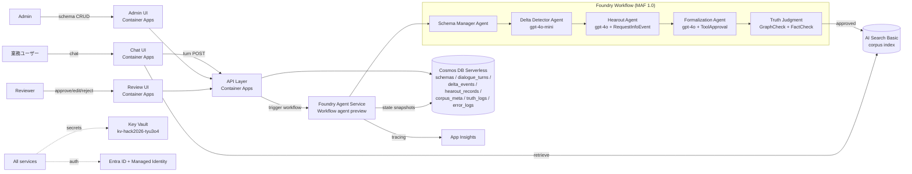
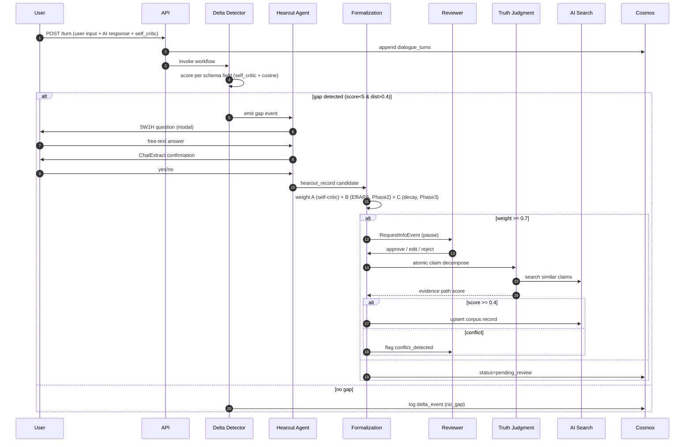
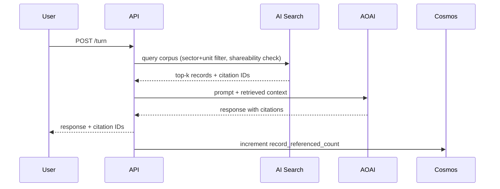
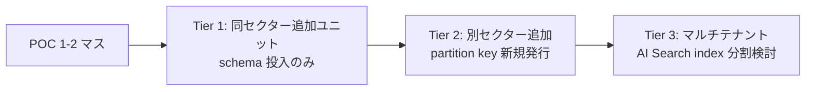

# Design Document

> 本書は `requirements.md` v0.1 (12 EARS 要件) と `research.md`（暗黙知形式化 + Azure agent platform）の結論を踏まえた MVP 設計初版。Week 1 flag day (2026-05-18) 検証結果と 5/14 セッションのセクター×ユニット最終確定で更新する想定。

## Overview

**Purpose**: 業務対話を Microsoft Agent Framework (MAF) 1.0 + Foundry Agent Service Workflow で監視し、AI 出力と人間入力の差分から暗黙知を 5W1H ヒアリングで externalize、重み付き形式化と corpus 投入を HITL でゲートする MVP を提供する。

**Users**: 対象組織 (例: AI 推進部門)の業務ユーザー（PM / 営業）が業務対話を行い、知識管理担当（admin）がスキーマとレビュー UI を運用する。ハッカソン審査員には 3 分デモで「対話差分 → ヒアリング → 形式化 → 次回参照」の場面転換を見せる。

**Impact**: 既存の AOAI gpt-4o-mini swedencentral / Container Apps / AI Search / Cosmos / App Insights / Key Vault `kv-hack2026-tyu3o4` 資産を再利用し、新規追加は Foundry Workflow 定義と AI Search corpus index のみ。

### Goals

- 5W1H ヒアリングで構造化された暗黙知 record を 1 セクター×ユニットで 50 件以上蓄積する（デモ説得力）
- HITL 承認後の record が次回対話で必ず retrieve され引用 ID が応答に明示される
- 6 週で $200 予算内、scale-to-zero による idle コスト最小化

### Non-Goals

- 8 セクター×10 ユニット全マス展開（POC は 1-2 マス、アーキは多マス対応設計のみ）
- push 朝刊配信（削除済）
- 検索 SPA の作り込み（nice-to-have、Week 5 以降に余力次第）
- LLM 自己批評の高度バイアス補正（Phase 2 以降）
- マルチテナント / 外部組織共有

## Architecture

### Architecture Pattern & Boundary Map



**Selected pattern**: **Foundry Workflow + MAF 1.0 + BYO Cosmos のハイブリッド**。理由は研究 #2（`../../../docs/research/azure-agent-platform-decision.md`）に詳述。バックアップは MAF を Container Apps に直接デプロイ。

**Boundaries**:
- **Stateless API / UI 層** (Container Apps): turn 投入、schema CRUD、review 操作のみ
- **Stateful agent 層** (Foundry Workflow): orchestration / HITL pause-resume / checkpoint
- **永続化層** (Cosmos + AI Search): conversation state は Foundry が BYO Cosmos に書込、corpus は AI Search

**Existing patterns preserved**:
- Container Apps Environment / Entra ID / Managed Identity / Key Vault は scaffold 済構成を踏襲
- App Insights を全 agent / API のテレメトリ単一吸込み口とする

### Technology Stack

| Layer | Choice / Version | Role in Feature | Notes |
|-------|------------------|-----------------|-------|
| Frontend | React 18 + Vite (SPA shell × 3: Chat / Admin / Review) | ユーザー / Admin / Reviewer の操作面 | 3 SPA を 1 Container App で host |
| Backend / Services | Node.js 20 + Fastify (API), MAF 1.0 .NET SDK or Python SDK (agents) | turn 投入 / schema CRUD / review、agent 実装 | SDK 言語は flag day で決定 |
| Agent Runtime | Microsoft Foundry Agent Service (Workflow agent preview) | 4 agent orchestration + HITL | swedencentral region 提供状況は Week 1 検証 |
| Data / Storage | Cosmos DB Serverless / AI Search Basic | 状態永続 / corpus 検索 | partition key = `{sector}#{unit}` |
| Messaging / Events | MAF `RequestInfoEvent` / `ToolApprovalRequestContent` | HITL pause-resume | チェックポイントは Cosmos に JSON |
| Infrastructure / Runtime | Azure Container Apps (existing env), Key Vault, App Insights, Managed Identity | host / secrets / telemetry / auth | scale-to-zero、idle 5 分で停止 |
| Models | AOAI gpt-4o (Hearout/Formalization), gpt-4o-mini (Delta scoring/Truth assist) | 推論 | swedencentral 既存リソース流用 |

> Foundry Hosted agent が swedencentral で未提供だった場合は MAF を Container Apps に直接デプロイ。コードは converged runtime のため移植可能。

## System Flows

### Dialogue → Delta → Hearout → Formalization → Corpus



### Retrieval (next dialogue)



## Requirements Traceability

| Req | Summary | Components | Interfaces | Flows |
|-----|---------|------------|------------|-------|
| 1 | スキーマ事前定義 | Schema Manager Agent, Admin UI | `POST /schemas`, Cosmos `schemas` | Admin CRUD |
| 2 | 対話監視 | API, Cosmos | `POST /turn` | 上記 step 1-2 |
| 3 | Delta Detector | Delta Detector Agent | embedding + self_critic scoring | step 3-4 |
| 4 | 5W1H ヒアリング | Hearout Agent | `RequestInfoEvent`, ChatExtract follow-up | step 5-7 |
| 5 | 重み付き形式化 | Formalization Agent | A×B×C 重み計算 | step 8 |
| 6 | HITL レビュー | Review UI, Formalization | `ToolApprovalRequestContent` | step 9-10 |
| 7 | 正誤判定 | Truth Judgment | GraphCheck + FactCheck ensemble | step 11-12 |
| 8 | corpus 参照 | API, AI Search | retrieval flow | Retrieval seq |
| 9 | 多マス対応 | 全 component | partition key `{sector}#{unit}` | 全 flow |
| 10 | 観測性 | App Insights | `customMetrics`, cost alerts | 全 flow |
| 11 | セキュリティ | Entra ID + Managed Identity + Key Vault | per-agent identity | 全 flow |
| 12 | 予算管理 | App Insights alerts | Tier A/C scope cut hooks | weekly report |

## Components and Interfaces

| Component | Layer | Intent | Req | Key Deps | Contracts |
|-----------|-------|--------|-----|----------|-----------|
| Schema Manager Agent | Agent | スキーマ CRUD + Delta Detector への配布 | 1, 9 | Cosmos (P0) | Service, State |
| Delta Detector Agent | Agent | 差分スコアリングと gap 判定 | 3, 9 | AOAI gpt-4o-mini (P0), Cosmos (P0) | Service, Event |
| Hearout Agent | Agent | 5W1H 質問生成と ChatExtract 確認 | 4 | AOAI gpt-4o (P0), MAF RequestInfo (P0) | Service, Event, State |
| Formalization Agent | Agent | 重み計算 + HITL queue 投入 + Truth Judgment 呼出 | 5, 6, 7 | AOAI (P0), AI Search (P0), MAF ToolApproval (P0) | Service, State, Event |
| Truth Judgment Module | Agent (sub) | atomic claim 分解と evidence path scoring | 7 | AI Search (P0), AOAI (P0) | Service |
| API Layer | Service | turn 投入 / schema CRUD / review 操作 | 2, 6, 8 | Cosmos (P0), Foundry (P0) | API |
| Chat / Admin / Review UI | Frontend | ユーザー操作面 | 1, 2, 4, 6 | API (P0) | API |
| Cost Telemetry | Cross-cutting | 予算アラート | 10, 12 | App Insights (P0) | Event |

### Agent Layer

#### Delta Detector Agent

| Field | Detail |
|-------|--------|
| Intent | 対話 turn を schema と照合し gap event を emit |
| Requirements | 3.1-3.5, 9.1 |

**Responsibilities & Constraints**
- 各 turn に対し active schema fields 全件を 1 回でスコアリング（重複検知抑制は 7 日 cooldown ロジックで実現）
- partition key `{sector}#{unit}` を必ず使い他マス schema を読まない
- gap 判定後は次 agent (Hearout) を起動するだけ、ヒアリング内容には立ち入らない

**Dependencies**: Cosmos `schemas`, `dialogue_turns`, `delta_events` (P0) / AOAI gpt-4o-mini embedding + completion (P0)

**Contracts**: Service ✓ / Event ✓

```typescript
interface DeltaDetector {
  scoreTurn(input: { turnId: string; sector: string; unit: string }): Promise<DeltaScoreResult>;
}
type DeltaScoreResult = {
  perField: Array<{
    schemaFieldId: string;
    selfCriticScore: number; // 0-10
    semanticDistance: number; // 0-1 cosine
    gapDetected: boolean;
  }>;
  gapsEmitted: string[]; // schema_field_id
};
```
- Preconditions: turn は Cosmos に保存済、self_critic_score が記録済
- Postconditions: gap event 発火数だけ `delta_events` が新規行 1 件以上
- Invariants: 同一 (session, schema_field) で連続 3 turn 以上の gap 抑制

#### Hearout Agent

| Field | Detail |
|-------|--------|
| Intent | Kunumi 5-step + 5W1H + ChatExtract で構造化応答を回収 |
| Requirements | 4.1-4.6 |

**Responsibilities & Constraints**
- 5 ターン上限、超過時は強制終了
- ユーザーが skip を選んだら即 `outcome: skipped` で確定
- 通常チャットとは UI を分離（modal）

**Dependencies**: AOAI gpt-4o (P0) / MAF `RequestInfoEvent` (P0) / Cosmos `hearout_records` (P0)

**Contracts**: Service ✓ / Event ✓ / State ✓ (`AgentThread` checkpoint via Foundry)

```typescript
interface HearoutAgent {
  start(input: { gapEventId: string; userId: string }): Promise<HearoutSession>;
  respond(sessionId: string, answer: string | "SKIP"): Promise<HearoutTurn>;
}
type HearoutTurn = { sessionId: string; nextQuestion?: string; finalRecord?: HearoutRecord; status: "in_progress" | "completed" | "skipped" | "expired" };
type HearoutRecord = { who?: string; what?: string; when?: string; where?: string; why?: string; how?: string; rawTranscript: string };
```

#### Formalization Agent

| Field | Detail |
|-------|--------|
| Intent | 重み計算 → 閾値判定 → HITL queue → 承認後 Truth Judgment 起動 |
| Requirements | 5.1-5.6, 6.1-6.6, 7.1-7.5 |

**Contracts**: Service ✓ / State ✓ / Event ✓

```typescript
interface FormalizationAgent {
  weight(record: HearoutRecord, userId: string): WeightBreakdown;
  submitForReview(record: HearoutRecord, weight: WeightBreakdown): Promise<ReviewTicketId>;
  onReviewDecision(ticket: ReviewTicketId, decision: "approve" | "edit" | "reject", edited?: HearoutRecord): Promise<CorpusUpsertResult | RejectResult>;
}
type WeightBreakdown = { a: number; b: number; c: number; final: number };
```
- Invariants: MVP では b = c = 1.0、final = a / 10
- 閾値 final < 0.7 → `pending_review`、>= 0.7 → reviewer queue
- 承認後の Truth Judgment で `evidence_path_score < 0.4` なら reject されレビュー再投入

### Service Layer

#### API Layer

**Contracts**: API ✓

| Method | Endpoint | Request | Response | Errors |
|--------|----------|---------|----------|--------|
| POST | /turn | `{userId, sector, unit, sessionId, userContent, aiResponse, selfCritic, redact?}` | `{turnId, gapDetected}` | 400, 401, 500 |
| GET | /schemas?sector&unit | – | `SchemaField[]` | 401 |
| POST | /schemas | `SchemaField` | `{schemaFieldId, revisionId}` | 400, 401, 409 |
| GET | /reviews?status=pending | – | `ReviewTicket[]` | 401 |
| POST | /reviews/:id/decision | `{decision, edited?}` | `ReviewTicket` | 400, 401, 404, 409 |
| GET | /retrieve?sector&unit&query | – | `{records: CorpusRecord[], citations: string[]}` | 401 |

## Data Models

### Cosmos DB collections (partition key = `{sector}#{unit}` 共通)

| Collection | Key fields | Purpose |
|------------|-----------|---------|
| `schemas` | `id, sector, unit, fieldName, description, expectedType, example, aiBaseline, isActive, revisionId, updatedAt` | Req 1 |
| `dialogue_turns` | `id, sessionId, turnId, role, content?, selfCritic?, redact, timestamp` | Req 2 |
| `delta_events` | `id, turnId, schemaFieldId, selfCritic, distance, gapDetected, cooldownUntil` | Req 3 |
| `hearout_records` | `id, gapEventId, sessionId, transcript, who/what/when/where/why/how, outcome` | Req 4 |
| `formalization_queue` | `id, hearoutId, weightA, weightB, weightC, weightFinal, status, reviewerId, decision, editDiff, expiredAt` | Req 5, 6 |
| `truth_judgment_logs` | `id, recordId, atomicClaims[], evidenceScore, ensembleVotes[], conflict` | Req 7 |
| `corpus_meta` | `id, recordId, schemaFieldId, referencedCount, lastReferencedAt, shareability` | Req 8 |
| `error_logs` | `id, ts, agent, stack, lastTurnId` | Req 10 |

Embedding vs referencing: `hearout_records.transcript` は埋込（一括 retrieval 効率）、`formalization_queue.editDiff` は監査用に別行参照。

### AI Search Basic — `corpus-{env}` index

| Field | Type | Searchable | Filterable |
|-------|------|-----------|-----------|
| id | Edm.String (key) | – | ✓ |
| sector | Edm.String | – | ✓ |
| unit | Edm.String | – | ✓ |
| schemaFieldId | Edm.String | – | ✓ |
| content | Edm.String | ✓ | – |
| atomicClaims | Collection(Edm.String) | ✓ | – |
| weightFinal | Edm.Double | – | ✓ (sort) |
| shareability | Edm.String | – | ✓ |
| createdAt | Edm.DateTimeOffset | – | ✓ |
| vector | Collection(Edm.Single) | ✓ (vector) | – |

> 多マス対応: filter は `sector eq '...' and unit eq '...' and shareability ge '...'`。マス追加時は index 1 本のまま運用。

## Error Handling

### Error Strategy

| Category | Pattern | Example |
|----------|---------|---------|
| User input (400) | フィールドバリデーション、UI に inline 表示 | schema field 上限 30 超過 |
| Auth (401/403) | Entra ID トークン期限、UI で再ログイン誘導。詳細は内部ログのみ (Req 11.5) | Managed Identity 失効 |
| Not found (404) | UI でナビゲーション補助 | レビュー ticket 消失 |
| Conflict (409) | リトライ可能性を返す | schema 同一 revision の重複更新 |
| Business (422) | `weight < 0.7` や `evidence < 0.4` は専用フラグで UI 表示 | `pending_review`, `conflict_detected` |
| System (5xx) | Foundry checkpoint で resume、Cosmos に `error_logs`、Discord 通知 (Req 6.6 / 10.4) | AOAI rate limit |
| Cost gate | App Insights alert で operator に Tier A/C 削減提案 | 累積 $120 / $150 |

### Monitoring

- App Insights `customMetrics` に `agent.{name}.duration_ms`, `agent.{name}.tokens`, `dialogue.turn.recorded`, `corpus.retrieved.count` を emit
- 1 日 1 回 Cron で AOAI token を集計、$120 / $150 で alert
- Foundry agent tracing は標準 dashboard で可視化

## Testing Strategy

### Unit Tests
- Delta Detector: gap 閾値境界 (4.99 / 5.0 / 5.01) で判定一致
- Weight calculator: A=10/B=1/C=1 → final=1.0、A=6/B=0.8/C=0.9 → final=0.432
- Schema cooldown: 連続 3 turn 抑制後の 4 turn 目で gap 再発火
- AI Search filter: `shareability` 不一致 record が retrieve から除外される
- ChatExtract follow-up: ユーザー "違う" 応答時の record 破棄

### Integration Tests
- E2E turn 投入 → gap → Hearout 5W1H → Formalization → Reviewer 承認 → AI Search upsert → 次 turn の retrieval で引用 ID 返却
- HITL pause-resume: `RequestInfoEvent` で停止 → 24h タイマー満了で `expired` + Discord 通知
- 多マス: 同時刻に sector A/B の turn が来てもパーティション分離で互いの schema を読まない
- Truth Judgment: 矛盾 claim で `conflict_detected` フラグ
- 認証失敗時: ユーザー側は generic 5xx、内部 `error_logs` に詳細

### E2E / UI Tests
- Admin が schema 5 件登録 → Chat UI で gap 検知 → modal で 5W1H 回答 → Review UI で承認 → 同セッション続き turn で citation ID 表示
- Reviewer 編集フローで `edit_diff` が監査ログに残る
- Redact フラグ立てた turn の content が Cosmos に保存されない

### Performance / Cost
- Hearout 1 セッション平均 < 2000 token（gpt-4o）目標
- Delta Detector 1 turn 100ms 以内、scale-to-zero 復帰 cold start 5s 以内
- 累積コスト weekly report が想定 ±20% 内に収まる

## Security Considerations

- Per-agent Entra identity を Foundry の管理機能で発行、最小権限スコープ（Schema Manager は Cosmos `schemas` のみ、Delta Detector は read-only など）
- すべての secret は Key Vault `kv-hack2026-tyu3o4` 経由、API キー直接利用禁止
- `redact = true` turn は content を保存せずメタデータのみ
- Review UI は Reviewer ロール（Entra Group）でのみアクセス可
- 認証エラー時の詳細は内部ログのみ、ユーザーには汎用 5xx
- 合成 corpus とはいえクライアント機密に類似する内容を含む可能性があるため、`shareability` フィールドで retrieval スコープを field 単位で制御

## Performance & Scalability

- Container Apps scale-to-zero、idle 5 分で停止（Req 12.4）
- Foundry Workflow の checkpoint で長期 (>1h) ヒアリング中断にも対応
- POC 1-2 マスでは Cosmos Serverless / AI Search Basic で十分。多マス展開時は AI Search index を sector ごとに分割するオプションを残す（partition key 設計で migration 不要）

## Migration Strategy

POC 段階では migration 不要。将来の組織展開時は以下：



- Rollback trigger: 累積コスト超過 / Foundry preview 機能の breaking change
- Validation checkpoint: 各 Tier で先行マスの retrieve 引用率 / reviewer 承認率を比較

## Supporting References

- `../../../docs/research/tacit-knowledge-ai-prior-art.md` — Kunumi / EffiARA / GraphCheck / FactCheck / ChatExtract / PKAI / 企業製品比較
- `../../../docs/research/azure-agent-platform-decision.md` — Foundry + MAF 1.0 + BYO Cosmos 採用根拠、Week 1 flag day 計画
- `../../../docs/research/sector-unit-candidates.md` — POC マス選定 4 軸評価、推奨 A (戦略×製造業 / 人材アサイン)
- `../../../docs/architecture-cards/idea-f-dialogue-monitoring.md` — 上流アーキ判断カード
