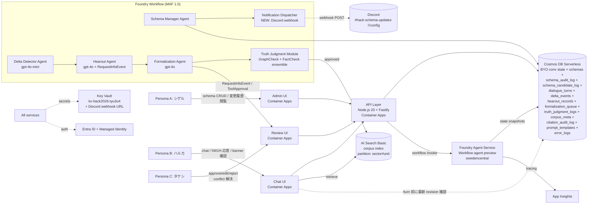
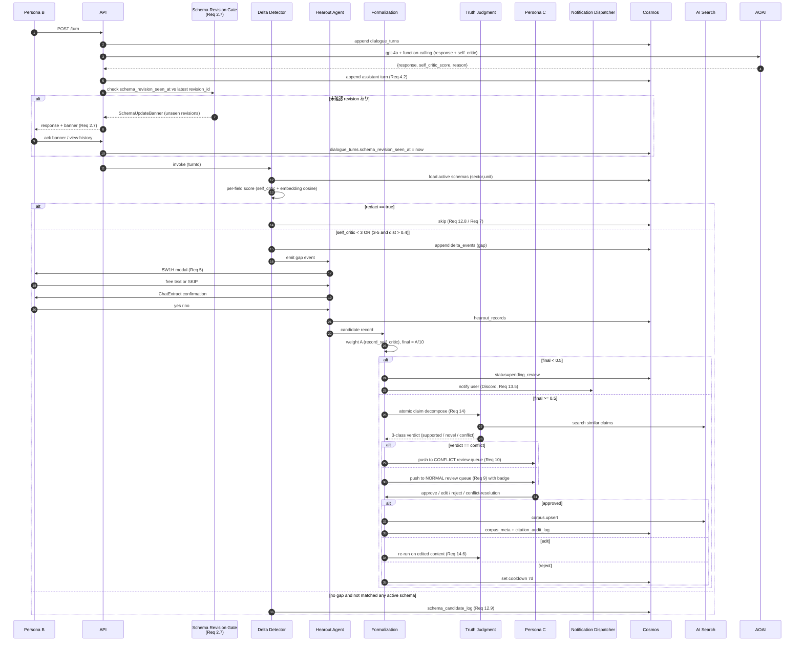
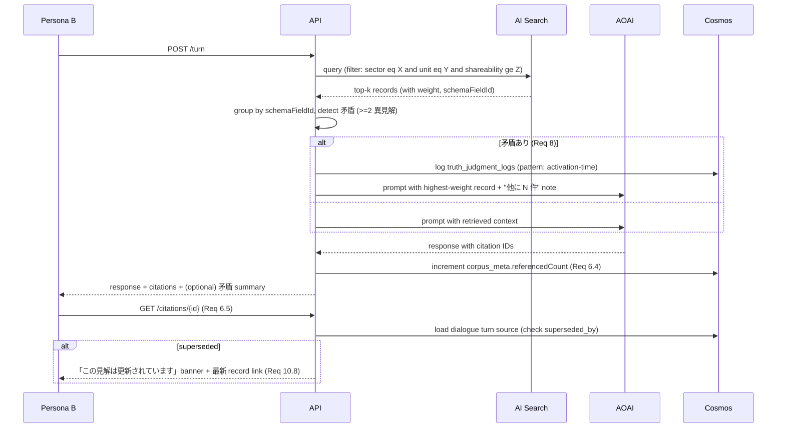
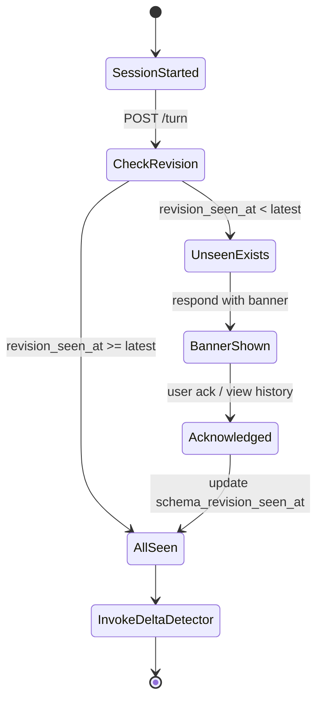
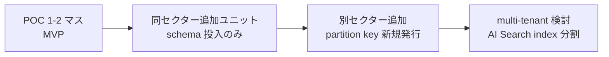

# Design Document

> 本書は `requirements.md` v2（persona-driven、Req 1–18、§A/B/C/D/E 構成）および `personas-stories.md`（Persona A/B/C、JTBD、3-act シナリオ）を起点に **再生成**した設計第 2 版。
> v1 design は requirements v0.1（12 EARS）ベースで stale 化したため、本書で全面差し替える。
> 直近の追加: **2026-05-25 Daichi review 反映 — Req 2 AC #5/#6/#7（schema 更新通知 / 変更履歴 view / 最新スキーマ確認済フラグ）**。
> 直近の合意: **Sotaro 承認 caveat — want/must 混在は spec-driven build → 機能レビュー → 改修サイクルで吸収**。MVP 境界（今回ビルド vs Follow-up）を本書で明示する。
> spec.json: phase = `requirements-approved`、language = `ja`。

---

## 0. Overview

### Purpose

特定セクター × ユニット業務対話を **Microsoft Agent Framework (MAF) 1.0 + Microsoft Foundry Agent Service（Workflow agent preview）** で監視し、`{schema, AI 出力, 人間入力}` の差分から暗黙知を検知 → 5W1H ヒアリング → 重み付き形式化 → HITL レビュー → Truth Judgment → AI Search corpus 投入 → 次回対話で参照、までの閉ループを MVP として実装する。

### Personas（[`personas-stories.md`](./personas-stories.md) §1 と一致）

| Persona | 役割 | 設計上の主要 surface |
|---------|------|----------------------|
| **A: 知識管理者 シゲル** | スキーマ CRUD / 監査 / 横展開 | Admin UI、Schema Manager Agent、`schema_audit_log`、Notification Dispatcher（new） |
| **B: 業務ユーザー ハルカ** | 通常対話 / 5W1H ヒアリング協力 / 過去 record 参照 / redact / 矛盾通知受領 | Chat UI、Hearout modal、Retrieval flow、Conflict Inline Banner、Schema-Update Banner（new） |
| **C: レビュアー タケシ** | record の承認 / 編集 / 拒否 / 矛盾解決 / SLA 監視 | Review UI（通常 queue + conflict queue）、`citation_audit_log` |

### Impact

- **新規追加**: Foundry Workflow 定義 / AI Search `corpus` index / 5 Cosmos collection（new: `schema_audit_log`, `schema_candidate_log`, `prompt_templates`, `citation_audit_log`）/ **Notification Dispatcher（Discord webhook）** / Schema History Read View。
- **既存再利用**: AOAI swedencentral / Container Apps Environment / Key Vault `kv-hack2026-tyu3o4` / App Insights / Entra ID + Managed Identity。

### Goals（MVP の DoD = 今回ビルドで満たす）

1. Critical path（A1 → B1 → B2 → C1 → B3）の閉ループが 1-2 マスで end-to-end 動作
2. **R2 AC #5/#6/#7 = schema 通知系の最小実装**（Discord webhook + 変更履歴 read view + 業務ユーザー banner）
3. **R-06 ヒアリング介入 UX**（modal は通常チャット併存、5 ターン上限、skip 可、cold start ≤ 3 秒）
4. HITL 承認後 record が次回 turn で必ず retrieve され citation ID が応答に明示
5. Azure 予算 $200 内（想定 $143）/ wall-clock 6 週

### Non-Goals（MVP では作らない、Follow-up 行き）

§1「MVP 境界」表に明示。

---

## 1. MVP 境界（**今回ビルド** vs Follow-up）

> Sotaro 承認 caveat（want/must 混在 → spec-driven 改修サイクルで吸収）への直接の応答。
> 機能レビュー後の改修サイクル（M9-M12 想定、reviewer feedback と運用メトリクスで再判定）で Follow-up 列の項目を順次格上げ／格下げする。

| Layer | MVP（今回ビルド = M2-M8） | Follow-up（機能レビュー後判定 = M9-M12） | 根拠 / 関連 Req |
|-------|---------------------------|-------------------------------------------|-----------------|
| **重み付け** | 層 A（LLM 自己批評, 0-10）のみ。final = A/10。閾値 **0.5** | 層 B（EffiARA）/ 層 C（時間減衰）、閾値 0.7 復帰 | Req 13 AC1, AC4-6 |
| **正誤判定** | GraphCheck + 冷起動期 FactCheck 3 LLM 投票 | Web/KG ハイブリッド（Bing/Wikipedia grounding） | Req 14、設計ベースライン |
| **スキーマ通知** | **R2 AC #5: Discord webhook**（既存 AI Club bot 同居チャネル `#hack-schema-updates` 想定、ID は config）/ AC #6: 業務ユーザー向け read-only 変更履歴 view / AC #7: Hearout 起動前 banner | Teams Adaptive Card、メール通知、ベテラン PM の opt-in subscription | **Req 2.5 / 2.6 / 2.7（new）** |
| **Persona A 横展開** | 単一マス CRUD、partition key 自動分離 | 一括 import UI、テンプレ複製、マス間 schema diff | Req 1, 3 |
| **Persona B redact** | `redact=true` で content 非保存、retrospective 物理削除 | redact 検知 LLM scrubbing（自動候補提示） | Req 7 |
| **Persona B 矛盾通知（B5）** | inline「他に N 件の異なる見解あり」+ 並列表示 | proactive な「あなたの過去 record と矛盾」warning | **Req 8（B5 独立）** |
| **Persona C レビュー** | 承認/編集/拒否 + 重み breakdown tooltip + 自己承認率 dashboard + 並行 lock（5 分 TTL） | Reviewer pool 自動 routing の高度化、レビュー学習 loop | Req 9 |
| **Persona C 矛盾判断（C4）** | 専用 conflict queue + 並列比較 + 3 択（採用/維持/共存）+ `citation_audit_log` | conflict クラスタリング、自動マージ提案 | **Req 10（C4 独立）** |
| **検索 SPA（pull retrieval UI）** | 出さない（D1 暫定: nice-to-have 維持） | デモ後 wall-clock 余力 + ナラティブ judgment で昇格判定 | decisions.md D1 |
| **2nd spec（追加業務改革ナラティブ）** | 出さない | ナラティブ強度判定で必要時のみ追加 | decisions.md D2 |
| **multi-tenant / マス横断検索** | 出さない | Phase 2 で shareability=public のマス横断検索を検討 | Req 6 AC1 |
| **embedding モデル切替** | 固定（`text-embedding-3-small`） | 全 index 再構築コストを織り込み Phase 2 で判定 | Req 18 AC5, AC6 |

**MVP 境界の運用ルール**（Sotaro caveat 吸収機構）:
- want/must 混在の解消は **「機能レビュー → 運用メトリクスを根拠に Follow-up 列を昇格／降格」** で行う。spec 段階での先回り削減はしない。
- 「Follow-up」列の項目は `tasks.md` で **チケットとして起票するが MVP マイルストーンには入れない**。改修サイクルで再勘案する。

---

## 2. Architecture

### 2.1 全体図



### 2.2 採用パターン

**Foundry Workflow + MAF 1.0 + BYO Cosmos のハイブリッド**。根拠は `../../../docs/research/azure-agent-platform-decision.md`。
- Stateless API / UI 層: turn 投入 / schema CRUD / review 操作 / 履歴 view（Container Apps）
- Stateful agent 層: orchestration / HITL pause-resume / checkpoint（Foundry Workflow）
- 永続化層: Cosmos（conv state + メタデータ） / AI Search Basic（corpus）
- バックアップ: Foundry preview が swedencentral で機能不全の場合は **MAF を Container Apps に直接デプロイ**（converged runtime のためコード移植可能、Week 1 flag day 2026-05-18 検証結果は research.md 参照）

### 2.3 Boundary 原則

- アプリ側は workflow 状態を抱えない（Foundry checkpoint に集約）
- すべての永続化リソースは **partition key = `{sector}#{unit}`** で水平展開可能（Req 15）
- HITL は **MAF `RequestInfoEvent` / `ToolApprovalRequestContent` の標準機構のみ**を使う

### 2.4 Technology Stack

| Layer | Choice | Role | Notes |
|-------|--------|------|-------|
| Frontend | React 18 + Vite（Chat / Admin / Review 3 SPA shell × 1 Container App） | Persona A/B/C の操作面 | TS strict、`any` 禁止 |
| API | Node.js 20 + Fastify | turn 投入 / schema CRUD / review / 履歴 view / banner check | TS strict |
| Agent SDK | **Microsoft Agent Framework 1.0**（2026-04-03 GA） | agent 実装 SDK | Python 3.11+ または .NET 8+（flag day 後確定、Python 想定） |
| Agent Runtime | **Microsoft Foundry Agent Service (Workflow agent preview)** | orchestration / HITL / checkpoint | swedencentral 提供状況は research.md 2026-05-25 ログ参照 |
| Models | AOAI **gpt-4o**（Hearout / Formalization）/ **gpt-4o-mini**（Delta scoring / Truth assist）、`text-embedding-3-small`（embedding 固定） | 推論 / embedding | swedencentral 既存 |
| Data | **Cosmos DB Serverless**（BYO conv state + 全 collection）/ **AI Search Basic**（corpus index 1 本） | 状態永続 / 検索 | partition key = `{sector}#{unit}` |
| Messaging | MAF `RequestInfoEvent` / `ToolApprovalRequestContent` | HITL pause-resume | Cosmos に JSON checkpoint |
| Notifications | **Discord webhook**（new、R2 AC #5 / R11 AC3 / R13 AC5） | schema 更新 / SLA expired / `pending_review` 通知 | webhook URL は Key Vault 管理 |
| Infrastructure | Azure Container Apps（既存 env）/ Key Vault `kv-hack2026-tyu3o4` / App Insights / Entra ID + Managed Identity | host / secret / telemetry / auth | scale-to-zero（業務時間帯は `min_replicas=1`）|
| Budget | **$143 / $200**（バッファ $57） | コスト枠 | 累積 $120 / $150 で alert + Tier A/C 縮退 |

### 2.5 設計ルール（型 / 命名 / Trace）

- **型安全**: TypeScript は `strict` + `any`/`as` 禁止、`unknown` で受けて narrowing。Python は **type hints 必須**、`mypy --strict` 相当の lint を CI に組み込む（agent SDK が Python 確定後）。
- **コレクション命名**: snake_case（`schemas`, `schema_audit_log`, `schema_candidate_log`, `dialogue_turns`, `delta_events`, `hearout_records`, `formalization_queue`, `truth_judgment_logs`, `corpus_meta`, `citation_audit_log`, `prompt_templates`, `error_logs`）。
- **Partition key**: 全 collection 共通で `{sector}#{unit}`。
- **Mermaid 必須**: 本書のフロー / 状態遷移は Mermaid のみで描画（外部画像依存禁止）。

---

## 3. Requirements Traceability（Req 1–18 全件マッピング）

> 各 AC を component に対応付け。新 AC（Req 2.5/2.6/2.7）は太字。

| Req | AC | Components | Interface / Collection | Flow |
|-----|----|-----------|------------------------|------|
| **Req 1** スキーマ初期定義 | 1.1-1.5 | Schema Manager Agent / Admin UI | `POST /schemas`, Cosmos `schemas` | §4.1 Admin CRUD |
| **Req 2** 段階的調整 | 2.1-2.4 | Schema Manager / Admin UI | Cosmos `schemas`, `schema_audit_log` | §4.1 |
| **Req 2.5（new）** schema 更新通知 | 2.5 | **Notification Dispatcher（new）** | Discord webhook（POST） | §4.6 Notification |
| **Req 2.6（new）** 業務ユーザー向け変更履歴 view | 2.6 | Admin UI（reuse）/ Chat UI 内 History Panel | `GET /schemas/history?sector&unit`, Cosmos `schema_audit_log` | §4.6 |
| **Req 2.7（new）** 最新スキーマ確認済フラグ | 2.7 | Delta Detector pipeline 内 **Schema Revision Gate**、Chat UI Banner | Cosmos `dialogue_turns.schema_revision_seen_at` / `schemas.revision_id` | §4.6 |
| **Req 3** 横展開 | 3.1-3.4 | Admin UI / Schema Manager | `POST /schemas/bulk-import` | §4.1 |
| **Req 4** 通常対話 / ログ | 4.1-4.5 | Chat UI / API / Cosmos | `POST /turn` | §4.2 |
| **Req 5** 5W1H ヒアリング | 5.1-5.7 | Hearout Agent / Chat UI modal | `RequestInfoEvent`, ChatExtract follow-up, Cosmos `hearout_records` | §4.3 |
| **Req 6** 過去 record 参照 | 6.1-6.5 | API / AI Search / Chat UI | `GET /retrieve`, citation ID render | §4.4 Retrieval |
| **Req 7** redact | 7.1-7.4 | Chat UI / API / Cosmos | `POST /turn?redact=true`, `DELETE /turn/{id}` | §4.2 |
| **Req 8** 活用時矛盾通知（B5 独立） | 8.1-8.4 | Chat UI（inline）/ API | `GET /retrieve` 拡張、Cosmos `truth_judgment_logs (pattern: activation-time)` | §4.4 |
| **Req 9** レビュー action | 9.1-9.11 | Review UI / Formalization Agent | `RequestInfoEvent`, `POST /reviews/:id/decision`, Cosmos `formalization_queue` | §4.5 |
| **Req 10** 矛盾判断（C4 独立） | 10.1-10.8 | Review UI 専用 conflict queue / Formalization / Truth Judgment | `GET /reviews/conflict`, Cosmos `truth_judgment_logs (pattern: input-time)`, `citation_audit_log` | §4.5 + §4.7 Conflict |
| **Req 11** SLA expired | 11.1-11.6 | Review UI / Notification Dispatcher / API | Cron job + Discord webhook | §4.5 + §4.6 |
| **Req 12** Delta Detector | 12.1-12.10 | Delta Detector Agent | Cosmos `delta_events`, `schema_candidate_log` | §4.3 |
| **Req 13** 重み付き形式化 | 13.1-13.7 | Formalization Agent | Cosmos `formalization_queue`, Notification Dispatcher（pending_review 通知） | §4.5 |
| **Req 14** Truth Judgment | 14.1-14.7 | Truth Judgment Module | AI Search query, Cosmos `truth_judgment_logs` | §4.5 / §4.7 |
| **Req 15** 多マス対応 | 15.1-15.5 | 全 component（partition key 統一） / Cosmos `prompt_templates` | partition filter, system prompt inject | 全 flow |
| **Req 16** 観測性 | 16.1-16.6 | App Insights / Cost Telemetry / PII Scrubber | `customMetrics`, `cost.alert.fired` event | 全 flow |
| **Req 17** セキュリティ | 17.1-17.7 | Entra ID / Managed Identity / Key Vault / Foundry per-agent identity / Reviewer RBAC | scope check middleware | 全 flow |
| **Req 18** 予算管理 | 18.1-18.7 | Cost Telemetry subscriber / Foundry scale config | App Insights alert → Tier A/C 提案 | weekly report |

---

## 4. Components & Flows

### 4.1 Admin / Schema Manager（Persona A）

#### Components

- **Admin UI（React SPA）**: schema CRUD、is_active トグル、reject 率 dashboard、**変更履歴 read view（Req 2.6）**、自己承認率 dashboard、未解決 conflict 件数、Tier A/C 縮退提案表示。
- **Schema Manager Agent（MAF）**: schema upsert / revision 増分 / `schema_audit_log` 追記 / **Notification Dispatcher への event emit（Req 2.5）**。

#### Contract（TypeScript、`any` 禁止）

```typescript
interface SchemaField {
  id: string;
  sector: string;
  unit: string;
  fieldName: string;
  description: string;
  expectedValueType: "string" | "number" | "enum" | "structured";
  example: string;
  aiBaselineAssumption: string;
  isActive: boolean;
  revisionId: number;
  updatedAt: string; // ISO 8601
  updatedBy: string;
}

interface SchemaAuditEntry {
  id: string;
  schemaFieldId: string;
  revisionId: number;
  changeType: "create" | "update" | "deactivate" | "reactivate";
  diff: Record<string, { before: unknown; after: unknown }>;
  reason?: string;
  changedBy: string;
  changedAt: string;
}

interface SchemaManagerAgent {
  upsert(input: SchemaField): Promise<{ schemaFieldId: string; revisionId: number; auditEntryId: string }>;
  setActive(schemaFieldId: string, isActive: boolean, reason?: string): Promise<SchemaAuditEntry>;
  bulkImport(sourceSector: string, sourceUnit: string, targetSector: string, targetUnit: string): Promise<SchemaField[]>;
  getHistory(sector: string, unit: string, opts?: { limit?: number; since?: string }): Promise<SchemaAuditEntry[]>;
}
```

- Preconditions: 呼出元は Entra ID で admin ロール保持
- Postconditions: `schemas` upsert + `schema_audit_log` append + Notification Dispatcher へ `schema.updated` event emit
- Invariants: 過去 revision は物理削除しない

### 4.2 Chat UI / API（Persona B 通常対話 + redact）

#### Contract

```typescript
interface TurnRequest {
  userId: string;
  sector: string;
  unit: string;
  sessionId: string;
  userContent: string;
  redact?: boolean;
}
interface TurnResponse {
  turnId: string;
  aiResponse: string;
  selfCriticScore: number; // 0-10
  citations: CitationRef[];
  schemaUpdateBanner?: SchemaUpdateBanner; // Req 2.7
  gapDetected: boolean;
}
interface CitationRef { recordId: string; schemaFieldId: string; weight: number; supersededBy?: string }
interface SchemaUpdateBanner {
  unseenRevisionIds: number[];
  changedFieldsSummary: string;
  historyUrl: string;
}
```

- AI 応答は **同一 LLM 呼出で `{response, self_critic_score, self_critic_reason}` を function calling 構造化出力**（Req 12 AC2）。Critic agent は分離しない（MVP）。

### 4.3 Delta Detector + Hearout（B2 のコアフロー）

#### Sequence — 通常 turn → gap → 5W1H → 形式化 → レビュー → corpus



#### Hearout Agent contract

```python
from typing import Literal, TypedDict, Optional

class HearoutRecord(TypedDict):
    who: Optional[str]
    what: Optional[str]
    when: Optional[str]
    where: Optional[str]
    why: Optional[str]
    how: Optional[str]
    raw_transcript: str

class HearoutTurn(TypedDict):
    session_id: str
    status: Literal["in_progress", "completed", "skipped", "expired"]
    next_question: Optional[str]
    final_record: Optional[HearoutRecord]

class HearoutAgent:
    def start(self, gap_event_id: str, user_id: str) -> HearoutTurn: ...
    def respond(self, session_id: str, answer: str | Literal["SKIP"]) -> HearoutTurn: ...
```

- **5 ターン上限**、超過時は `status: "expired"` で hearout_records に保存
- **cold start ≤ 3 秒**（Req 18 AC7）: 業務時間帯（平日 9-19 JST）は `min_replicas=1` 維持

### 4.4 Retrieval（B3 過去 record 参照 + B5 活用時矛盾）



### 4.5 Review UI（Persona C：通常 + conflict + SLA）

#### 構成

- **通常 queue**: weight ≥ 0.5 かつ TJ verdict ∈ {supported, novel} の record。`{5W1H 要素 / A×B×C breakdown / 関連 turn / TJ バッジ}` 1 画面表示。
- **Conflict queue（独立 UI、Req 10）**: TJ verdict = conflict。並列比較表示で 3 択(新規採用 / 既存維持 / 両方残す)。
- **共通**: 24h SLA タイマー、5 分 lock TTL（`locked_by`, `lock_expires_at`）、自己承認率 dashboard（> 30% で warning）、レビュー中央値 > 3 分で「優先 3 件のみ」モード自動切替。

#### Contract

```typescript
type ReviewDecision = "approve" | "edit" | "reject";
type ConflictDecision = "adopt_new" | "keep_existing" | "coexist";

interface FormalizationAgent {
  weight(record: HearoutRecord, userId: string): WeightBreakdown;
  submitForReview(record: HearoutRecord, weight: WeightBreakdown, tjVerdict: TJVerdict): Promise<ReviewTicketId>;
  onReviewDecision(ticket: ReviewTicketId, decision: ReviewDecision, edited?: HearoutRecord): Promise<CorpusUpsertResult | RejectResult>;
  onConflictDecision(ticket: ReviewTicketId, decision: ConflictDecision): Promise<ConflictResolution>;
}
interface WeightBreakdown { a: number; b: number; c: number; final: number }
type TJVerdict = "supported" | "novel" | "conflict";
```

- Invariants: MVP は `b = c = 1.0`, `final = a / 10`、閾値 `0.5`
- AC9 (自己承認率)・AC10 (lock TTL)・AC11 (優先 3 件モード) は Review UI 側の middleware で実装

### 4.6 Notification Dispatcher（**new**、R2 AC #5/#6/#7 + R11 + R13）

> Daichi review 5/24 反映の中核 component。
> 「スキーマ更新が業務側に通知されず認識ズレ → ヒアリング過剰 → 業務離脱」リスクへの直接の応答。

#### Responsibilities

| Trigger | 配信内容 | 配信先 | 関連 Req |
|---------|----------|--------|----------|
| `schema.updated` event（Schema Manager Agent から emit） | `{sector, unit, revisionId, changeType, fieldName, diffSummary, historyUrl}` | Discord webhook(`#hack-schema-updates` 想定、ID は config) | **Req 2.5** |
| `record.pending_review`（Formalization） | 当該業務ユーザー本人への DM 風メッセージ | Discord webhook（ユーザー mention 可、フォールバック channel post） | Req 13.5 |
| `record.expired`（24h SLA Cron） | reviewer + 該当業務ユーザー | Discord webhook（業務ユーザーは「再ヒアリング / 諦める」選択肢付き） | Req 11.3, 11.4 |
| `cost.alert.fired`（App Insights） | operator | Discord webhook（admin channel） | Req 16.2 / Req 18 |

#### Discord webhook 統合ノート（AI Club 既存 bot との関係）

- AI Club は既に Discord bot を運用中（`personal-hub/ai-club/discord-bot`）。本 dispatcher は **bot を再利用せず webhook 単独**で配信する（依存方向を一方向に保つ + bot 障害と疎結合）。
- webhook URL は **config item**: `DISCORD_WEBHOOK_URL_SCHEMA_UPDATES` / `DISCORD_WEBHOOK_URL_PENDING_REVIEW` / `DISCORD_WEBHOOK_URL_EXPIRED` / `DISCORD_WEBHOOK_URL_COST_ALERT`。**ID / URL は本書にハードコードしない**。Key Vault `kv-hack2026-tyu3o4` で管理（Req 17.2）。
- 推奨チャネル名は `#hack-schema-updates`（新規）。既存通知チャネルがあれば運用判断で再利用可。
- 配信 payload は **PII scrubbing 後**（Req 16.6）。

#### Schema History Read View（Req 2.6）

- API: `GET /schemas/history?sector=&unit=&limit=&since=` → `SchemaAuditEntry[]`
- 描画: Admin UI と Chat UI 内 sidebar「最近の schema 変更」（業務ユーザー向け read-only）
- 認可: 業務ユーザーは自分の `reviewer_scope` 相当の sector×unit のみ閲覧可（Req 17.7 相当の partition filter）

#### Schema Revision Gate（Req 2.7）

- 配置: `POST /turn` 内、Delta Detector を invoke する直前
- ロジック:
  1. `dialogue_turns.schema_revision_seen_at` を session 単位で読む
  2. 当該 sector×unit の最新 `schemas.revision_id` と比較
  3. 未確認 revision があれば response に `schemaUpdateBanner` を載せる
  4. **banner ack 受信時に `schema_revision_seen_at = now` を upsert**。それまで gap 検知ループの結果は記録しつつ Hearout 起動は banner 提示後の次 turn に持ち越す（介入過剰を防ぐ）



### 4.7 Conflict 解決（C4 独立）

- TJ verdict = conflict → Conflict queue → Persona C が 3 択 →
  - `adopt_new`: 既存 record に `superseded_by = {new_id}`、新 record を corpus 投入、`citation_audit_log` に新旧対応記録
  - `keep_existing`: 新 record を `rejected_due_to_conflict`
  - `coexist`: 両 record を `coexisting_views` 関係で紐付け、Req 8 (B5) の活用時通知対象
- 過去 AI 応答からの引用 ID クリック時、`superseded_by` を辿って「この見解は更新されています」banner を出す（Req 10.8 + Req 6.5）

---

## 5. Data Model

### 5.1 Cosmos DB（partition key = `{sector}#{unit}` 共通）

| Collection | Key fields | Purpose | 関連 Req |
|------------|-----------|---------|---------|
| `schemas` | `id, sector, unit, fieldName, description, expectedValueType, example, aiBaselineAssumption, isActive, revisionId, updatedAt, updatedBy` | スキーマ本体 | Req 1, 2 |
| `schema_audit_log` | `id, schemaFieldId, revisionId, changeType, diff, reason, changedBy, changedAt` | 監査ログ + 業務ユーザー view ソース | Req 2.1, **2.5, 2.6** |
| `schema_candidate_log` | `id, turnId, suggestedFieldHint, llmReason, occurrences, lastSeenAt` | out-of-schema → admin 提案 | Req 12.9 |
| `prompt_templates` | `id, sector, unit, terminology, industryExamples, scenarioPrompts` | sector×unit 別 prompt inject | Req 15.5 |
| `dialogue_turns` | `id, sessionId, turnId, role, content?, selfCriticScore?, redact, timestamp, sector, unit, schema_revision_seen_at` | 対話ログ + **revision 確認状態** | Req 4, **2.7**, Req 7 |
| `delta_events` | `id, turnId, schemaFieldId, selfCritic, distance, gapDetected, cooldownUntil, matchedReason` | gap 判定根拠 | Req 12 |
| `hearout_records` | `id, gapEventId, sessionId, transcript, who/what/when/where/why/how, outcome, turnCount` | 5W1H 出力 | Req 5 |
| `formalization_queue` | `id, hearoutId, weightA, weightB, weightC, weightFinal, tjVerdict, status, lockedBy, lockExpiresAt, reviewerId, decision, editDiff, expiredAt` | レビュー queue + lock + SLA | Req 9, 10, 11, 13 |
| `truth_judgment_logs` | `id, recordId, atomicClaims[], evidenceScore, ensembleVotes[], verdict, pattern: "input-time" or "activation-time"` | TJ 判定履歴 + B5 活用時矛盾 | Req 14, 8, 10 |
| `corpus_meta` | `id, recordId, schemaFieldId, referencedCount, lastReferencedAt, shareability, isActive, supersededBy?, coexistingViews?` | corpus メタ + 論理削除 + 矛盾関係 | Req 6, 10, 17.6 |
| `citation_audit_log` | `id, oldRecordId, newRecordId, transition, occurredAt` | 引用先更新追跡 | Req 10.8 |
| `error_logs` | `id, ts, agent, stack, lastTurnMeta` | error（redact 時は content 除外） | Req 16.4 |

#### 新規追加（R2 AC #5/#6/#7 対応）field の置き場所まとめ

| Field | Collection | 用途 |
|-------|-----------|------|
| `schemas.revisionId` | `schemas` | 最新 revision 番号（Req 2.1 既存） |
| `schema_audit_log.*` | `schema_audit_log`（new） | 履歴 view と通知ペイロード source |
| `dialogue_turns.schema_revision_seen_at` | `dialogue_turns` | **session が最後に確認した revision の時刻** |
| `dialogue_turns.schema_revision_id_seen` | `dialogue_turns` | **その時点の最新 revisionId のスナップショット** |

### 5.2 AI Search Basic — `corpus-{env}` index

> 命名: snake_case 統一（contracts.md §3 と一致）。`scripts/provision_search_index.py` で provisioning。

| Field | Type | Searchable | Filterable | 備考 |
|-------|------|-----------|------------|------|
| id | Edm.String (key) | – | ✓ | |
| sector | Edm.String | – | ✓ | partition filter |
| unit | Edm.String | – | ✓ | |
| pk | Edm.String | – | ✓ | `{sector}#{unit}` |
| schema_field_id | Edm.String | – | ✓ | |
| content | Edm.String | ✓ | – | |
| atomic_claims | Collection(Edm.String) | ✓ | – | GraphCheck 用 |
| weight_final | Edm.Double | – | ✓ (sort) | |
| shareability | Edm.String | – | ✓ | private/unit/public |
| is_active | Edm.Boolean | – | ✓ | 論理削除（Req 17.6） |
| superseded_by | Edm.String | – | ✓ | conflict 解決後 |
| created_at | Edm.DateTimeOffset | – | ✓ | |
| vector | Collection(Edm.Single) | ✓ (vector, dim=1536) | – | `text-embedding-3-small` |

---

## 6. Error Handling

| Category | Pattern | 例 |
|----------|---------|----|
| User input (400) | UI inline 表示 | schema field 上限 30 超過、5W1H 必須欠落 |
| Auth (401/403) | Entra ID 再認証誘導、詳細は内部ログのみ（Req 17.5） | Managed Identity 失効 |
| Not found (404) | UI ナビ補助 | レビュー ticket 消失 |
| Conflict (409) | リトライ可否を返す | schema 同一 revision 重複更新、lock 競合 |
| Business (422) | 専用フラグで UI 表示 | `pending_review`, `conflict_detected`, `expired` |
| System (5xx) | Foundry checkpoint で resume、Cosmos `error_logs`（redact 時は content 除外、Req 16.4）、Discord 通知 | AOAI rate limit |
| Notification 失敗 | webhook 4xx/5xx は 3 回 backoff retry、最終失敗時 `error_logs` + admin Discord channel に二次通知 | Discord webhook URL 失効 |
| Cost gate | App Insights alert → Tier A/C 削減提案 | 累積 $120 / $150 |

---

## 7. Observability

- App Insights `customMetrics`: `agent.{name}.duration_ms`, `agent.{name}.tokens`, `dialogue.turn.recorded`, `corpus.retrieved.count`, `hearout.intervention.count`, `review.median_minutes`, `self_approval_rate.weekly`, `conflict.resolution_rate.30d`, `expired.rate.weekly`, `schema.notify.dispatched`, `schema.banner.shown`, `schema.banner.acked`
- 1 日 1 回 Cron で AOAI token 集計、$120 / $150 で `cost.alert.fired` emit
- PII scrubbing は emit 直前（Req 16.6）

---

## 8. Testing Strategy

### Unit
- Delta Detector: gap 閾値境界（self_critic 2.99 / 3.00 / 4.99 / 5.00、distance 0.39 / 0.40）
- Weight calculator: A=10/B=1/C=1 → final=1.0、A=4/B=1/C=1 → final=0.4（保留）
- Schema cooldown: 連続 3 turn 抑制後の 4 turn 目で再発火
- AI Search filter: `shareability` 不一致 / `isActive=false` / `supersededBy` 設定済 record の除外
- ChatExtract follow-up: ユーザー「違う」応答で record 破棄
- **Schema Revision Gate**: unseen revision あり → banner、ack 後 `schema_revision_seen_at` 更新、次 turn で Hearout 起動可
- **Notification Dispatcher**: webhook 4xx → 3 回 retry、最終失敗時 error_logs

### Integration
- E2E: turn 投入 → gap → Hearout 5W1H → Formalization → Reviewer 承認 → AI Search upsert → 次 turn の retrieval で citation 返却
- HITL: `RequestInfoEvent` で停止 → 24h タイマー満了で `expired` + Discord 通知 + 業務ユーザー再ヒアリング選択
- 多マス: 同時刻に sector A/B の turn でパーティション分離
- Truth Judgment: 矛盾 claim で conflict queue 振り分け
- **Schema 通知 E2E**: admin が schema 更新 → Discord webhook → 業務ユーザー次 turn で banner → ack → 通常 flow
- 認証失敗: ユーザーには 5xx、内部 `error_logs` に詳細
- redact: content 非保存、retroactive 物理削除、`error_logs` も content 除外

### Performance / Cost
- Hearout 1 セッション平均 < 2000 token（gpt-4o）
- Delta Detector 1 turn 100ms 以内、cold start ≤ 3 秒（業務時間帯）
- 累積コスト weekly report ±20% 内

---

## 9. Security

- 全 agent / Container Apps の認証は **Entra ID + Managed Identity**、API キー直接禁止（Req 17.1）
- AOAI / Cosmos / AI Search 接続文字列 + **Discord webhook URL 4 種** を Key Vault `kv-hack2026-tyu3o4` 管理（Req 17.2）
- **Foundry per-agent Entra identity** で最小権限スコープ（Schema Manager: `schemas` / `schema_audit_log` write のみ、Delta Detector: read-only、Notification Dispatcher: webhook send のみ等）
- `redact=true` turn は content 非保存（Req 7、Req 17.4）
- 認証エラー時の詳細はユーザーに返さず汎用 5xx + 内部ログのみ（Req 17.5）
- record 削除は論理削除（`is_active=false`）、引用先連鎖の安全のため物理削除しない（Req 17.6）
- Reviewer は **`reviewer_scope: [sector×unit]` を Entra group claim で持ち scope 外非表示**（Req 17.7）

---

## 10. Performance & Scalability

- Container Apps scale-to-zero（idle 5 分）、業務時間帯（平日 9-19 JST）は Foundry `min_replicas=1`（Req 18.7）
- Foundry Workflow checkpoint で長期（>1h）ヒアリング中断対応
- POC 1-2 マスでは Cosmos Serverless / AI Search Basic で十分
- 多マス展開時の AI Search index 分割オプションは partition key 設計で migration 不要

---

## 11. Migration Strategy



- Rollback trigger: 累積コスト超過 / Foundry preview の breaking change
- Validation checkpoint: 各 Tier で retrieve 引用率 / reviewer 承認率 / 自己承認率 / conflict resolution 率を前 Tier と比較

---

## 12. Supporting References

- `./requirements.md` v2（Req 1–18、Daichi review 2026-05-25 反映済）
- `./personas-stories.md`（Persona A/B/C、JTBD、3-act シナリオ）
- `./research.md`（本書と同時更新、2026-05-25 ログ参照）
- `../../../docs/research/tacit-knowledge-ai-prior-art.md` — Kunumi / EffiARA / GraphCheck / FactCheck / ChatExtract / PKAI
- `../../../docs/research/azure-agent-platform-decision.md` — Foundry + MAF + BYO Cosmos 採用根拠
- `../../../docs/research/sector-unit-candidates.md` — POC マス選定 + Tier A-F 縮退候補
- `../../../docs/architecture-cards/idea-f-dialogue-monitoring.md` — 上流アーキ判断カード
- `../../../../personal-hub/ai-club/discord-bot/` — AI Club 既存 Discord bot（本 spec の Notification Dispatcher は webhook 経由で疎結合）
- `../../steering/{product, tech, structure, decisions, development-model}.md`
